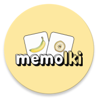
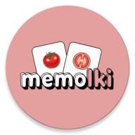
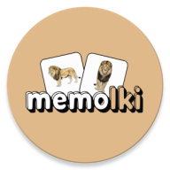
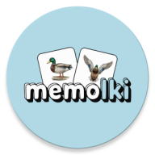

# 🃏 memolki

> A production Android memory card game built with Jetpack Compose, published on Google Play in multiple themed flavors with multi-language support.


<br>


## 📲 Google Play

<table>
  <tr>
    <td valign="middle"><a href="https://play.google.com/store/apps/details?id=com.wojdor.memolki.fruithalf"></a></td>
    <td valign="middle"><b>memolki • fruits</b></td>
    <td valign="middle"><a href="https://play.google.com/store/apps/details?id=com.wojdor.memolki.fruithalf"></a></td>
  </tr>
  <tr>
    <td valign="middle"><a href="https://play.google.com/store/apps/details?id=com.wojdor.memolki.vegetablehalf"></a></td>
    <td valign="middle"><b>memolki • vegetables</b></td>
    <td valign="middle"><a href="https://play.google.com/store/apps/details?id=com.wojdor.memolki.vegetablehalf"></a></td>
  </tr>
  <tr>
    <td valign="middle"><a href="https://play.google.com/store/apps/details?id=com.wojdor.memolki.mammalside"></a></td>
    <td valign="middle"><b>memolki • mammals</b></td>
    <td valign="middle"><a href="https://play.google.com/store/apps/details?id=com.wojdor.memolki.mammalside"></a></td>
  </tr>
  <tr>
    <td valign="middle"><a href="https://play.google.com/store/apps/details?id=com.wojdor.memolki.birdside"></a></td>
    <td valign="middle"><b>memolki • birds</b></td>
    <td valign="middle"><a href="https://play.google.com/store/apps/details?id=com.wojdor.memolki.birdside"></a></td>
  </tr>
</table>

## 🎯 Overview

Memolki is a card-matching memory game where players flip cards to find matching pairs. The app ships as **multiple themed flavors** — each with unique branding, card artwork, and Play Store listing — all powered by a shared game engine.

## ✨ Features

**Core Gameplay**
- Multiple board sizes with casual and daily challenge modes
- Progressive level system — unlock boards by matching pairs
- Coins economy — earn from gameplay, spend to unlock card sets
- Deterministic seeding for daily challenges (same puzzle for all players)

**Engagement & Social**
- Google Play Games integration — leaderboards and achievements
- Share results with friends (earns bonus coins)
- Daily login streaks with reminder notifications
- App shortcuts for quick access to daily challenge and shop

**Monetization**
- Ad-supported with multiple mediation partners (Unity, IronSource, Liftoff, InMobi, Mintegral)
- In-app review prompts via Google Play In-App Review API
- Google Play Billing integration

**Localization**
- Multi-language support including RTL (Arabic, Hebrew)
- In-app language switching without restart
- Per-flavor card name translations

**Notifications**
- Firebase Cloud Messaging with topic-based subscriptions
- Deep link routing to specific screens (shop, daily challenge, collection)
- Local alarm reminders (daily challenge, streak)

## 🏗️ Architecture

**MVI + Clean Architecture** with strict unidirectional data flow:

```
UI Layer (Jetpack Compose)
        ↓ Intent
Domain Layer (Use Cases → Flow<Result<T>>)
        ↓
Data Layer (Repositories → DataSources)
        ↓ State
UI Layer (Jetpack Compose)
```

### Screen Structure

Every feature screen follows a consistent **3-level composable hierarchy**:

1. **Entry point** — collects state from ViewModel, delegates to handlers
2. **Effect handler** — processes one-shot side effects (navigation, toasts)
3. **State handler** — wires callbacks to intents, renders stateless UI

This pattern enforces separation of concerns, enables previews for every screen, and keeps navigation logic isolated.

### Key Design Decisions

- **Use Cases** — each encapsulates a single business operation, returns `Flow<Result<T>>`
- **Strict layer boundaries** — domain never imports data-layer internals
- **Injectable dispatchers** — coroutine dispatchers injected via Hilt qualifiers, never hardcoded
- **Provider pattern** — Android framework calls abstracted behind interfaces for testability
- **Encrypted DataStore** — AES encryption for sensitive persistent data (coins, streaks)
- **Room Database** — structured storage for daily challenge history with proper migrations

## 🛠️ Tech Stack

| Category | Technology |
|----------|-----------|
| **Language** | Kotlin |
| **UI** | Jetpack Compose + Material 3 |
| **Architecture** | MVI + Clean Architecture |
| **DI** | Hilt (Dagger 2) with KSP |
| **Navigation** | Navigation Compose |
| **Persistence** | DataStore (encrypted) + Room |
| **Async** | Kotlin Coroutines + Flow |
| **Analytics** | Firebase Analytics + Crashlytics |
| **Messaging** | Firebase Cloud Messaging |
| **Ads** | AdMob with multi-network mediation |
| **Play Services** | Games v2, Auth, Billing, In-App Review, In-App Updates |
| **Build** | Gradle with version catalog, ProGuard/R8 |
| **CI/CD** | GitHub Actions + Gradle Play Publisher |
| **Testing** | JUnit 4, MockK, Turbine, Paparazzi |
| **Coverage** | Kover with badge generation |

## 🧪 Testing

Covers the full business logic layer:

- **Unit tests** for all ViewModels, Use Cases, Repositories, and DataSources
- **Screenshot tests** via Paparazzi — snapshot verification for all `@Preview` composables
- **Fake pattern** — Android framework calls abstracted via Provider interfaces, each with a corresponding Fake implementation
- **Flow testing** with Turbine for async assertions
- **Parameterized tests** via Test Parameter Injector

```bash
# Run all unit tests
./gradlew testFruitHalfDebugUnitTest

# Verify screenshot tests
./gradlew verifyPaparazziFruitHalfDebug

# Generate coverage report
./gradlew koverXmlReportFruitHalfDebug
```

## 🔄 CI/CD

| Workflow | Trigger | Actions |
|----------|---------|---------|
| **Pull Request** | Every PR | Unit tests, screenshot verification, coverage report on PR summary |
| **Coverage** | Merge to main | Generate unit test coverage badge, update via GitHub Gist |
| **Merge** | Merge to main | Build release bundles for all flavors, publish to Google Play |

## 🛡️ Anti-Cheat & Security

- **Encrypted game state** — all critical values (coins, levels, streaks, matched pairs) stored with AES-256-GCM authenticated encryption via a custom `Encryptor` layer on top of DataStore
- **IAP signature verification** — purchase validation using RSA + SHA1 against the Google Play billing public key, with proactive hacked signature detection that rejects tampered billing systems
- **R8 obfuscation** — release builds use ProGuard/R8 with resource shrinking enabled to hinder reverse engineering

## 🎨 Custom Compose Components

Reusable composable library including:

- **Animations** — `PulseEffect`, `ShakeEffect`, `ShimmerEffect`, `SparklesOverlay`, `EdgeSparklesEffect`
- **Card flip** — `Flippable` with 3D rotation animation
- **Auto-sizing text** — `AutoSizeText` that scales to fit container
- **Click effects** — `bounceClickEffect()` with throttle protection
- **Recording overlay** — `ClickIndicatorOverlay` showing tap points during video capture

## 🎬 Automation & Tooling

| Script | Purpose |
|--------|---------|
| `scripts/screenshot/` | Automated Play Store screenshot capture and composition with device frames |
| `scripts/recording/` | Video recording with deterministic gameplay, ffmpeg post-processing (music, fades, logos) |
| `scripts/listing/` | Play Store listing fetch/update across all flavors and languages |
| `scripts/notifications/` | FCM push notification sender |
| `scripts/image_generation/` | Card image resizing across density buckets |

## 📚 Documentation

Detailed docs live in [`docs/`](./docs/docs.md) covering logo generation, card image preparation, app icon setup, flavor onboarding, Play Store listing management, screenshot & video automation, and more.

## 📄 License

```
Copyright 2026 Wojciech Kryg. All Rights Reserved.

This source code is made available for viewing purposes only.
No permission is granted to use, copy, modify, merge, publish,
distribute, sublicense, or sell copies of this software without
prior written approval from the copyright holder.

For licensing inquiries, contact the author.
```
